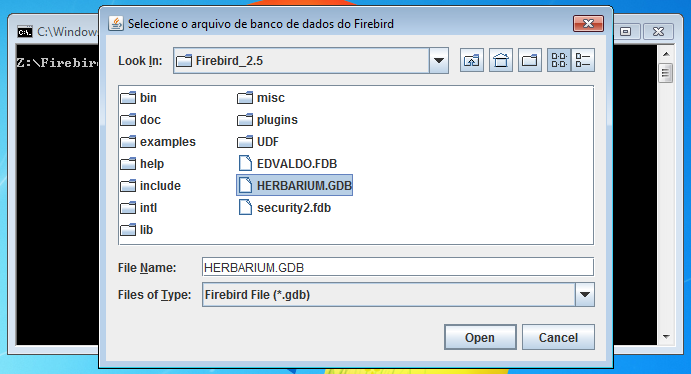
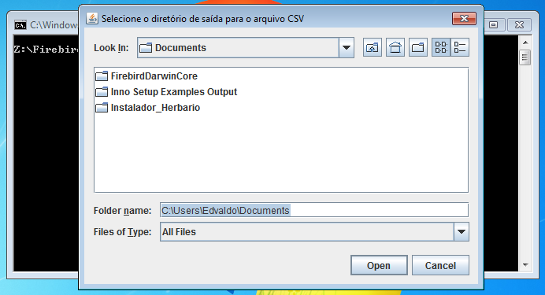
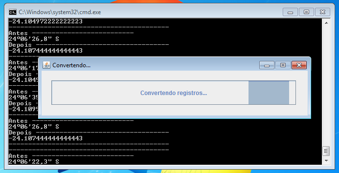

# FirebirdDarwinCoreConverter

Utilitário para conversão do banco de dados Firebird para DarwinCore

**Selecione o arquivo de banco de dados do Firebird**

**Selecione o diretório de saída do arquivo CSV**

**Aguarde a conclusão do processo**

